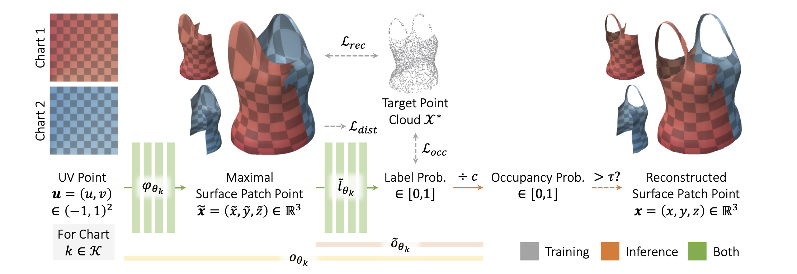

# Minimal Neural Atlas

This repository contains the official source code for the ECCV 2022 paper ["Minimal Neural Atlas: Parameterizing Complex Surfaces with Minimal Charts and Distortion"](https://arxiv.org/abs/2207.14782), which is built on the [PyTorch Lightning](https://www.pytorchlightning.ai/) framework. 

*Minimal Neural Atlas* is a novel explicit neural surface representation that can effectively learn a minimal atlas of 3 charts with distortion-minimal parameterization for surfaces of arbitrary topology. This is enabled by a fully learnable parametric domain, given by an implicit probabilistic occupancy field defined on the $(-1, 1)^2$ open square of the UV parametric space. In contrast, prior works generally predefine the parametric domain, which unnecessarily constrains the boundary and topology of each chart.



If you find our work or code useful, please consider citing us with:
```
@inproceedings{low2022_mna,
    title={Minimal Neural Atlas: Parameterizing Complex Surfaces with Minimal Charts and Distortion},
    author={Low, Weng Fei and Lee, Gim Hee},
    booktitle={European Conference on Computer Vision (ECCV)},
    year={2022}
}
```

## Installation
We recommend using [Conda](https://conda.io/) to set up an environment with the appropriate dependencies for running our code. This can simply be done by running:

```bash
git clone https://github.com/low5545/minimal-neural-atlas.git
cd minimal-neural-atlas
conda env create -f environment.yml
```

If you prefer a manual installation, the list of dependencies can be found in `environment.yml`.

## Dataset Preparation
Our experiments are conducted on two datasets: [CLOTH3D++](https://chalearnlap.cvc.uab.cat/dataset/38/description/) and [ShapeNet](https://shapenet.org/).

### CLOTH3D++
1. Download the raw CLOTH3D++ [training](https://chalearnlap.cvc.uab.cat/dataset/38/data/72/files/), [validation](https://chalearnlap.cvc.uab.cat/dataset/38/data/73/files/) and [test](https://chalearnlap.cvc.uab.cat/dataset/38/data/74/files/) datasets (all tracks)
2. Uncompress the downloaded `.tar.gz` files and place them in a common folder
3. Preprocess the raw dataset by running the following command from the `scripts/` directory:
    ```bash
    python preprocess_cloth3d++.py <raw_dataset_path> <preprocessed_dataset_path>
    ```

### ShapeNet
1. Download the [Occupancy Networks](https://github.com/autonomousvision/occupancy_networks)-preprocessed ShapeNet dataset from [this link](https://s3.eu-central-1.amazonaws.com/avg-projects/occupancy_networks/data/dataset_small_v1.1.zip)
2. Uncompress the downloaded `.zip` file to a desired location

## Usage
To train, validate or test our model, run the following command from the `scripts/` directory:
```bash
python run.py {train, val, test} <config_file_path>
```

## Configuration
In the `configs/` directory, we provide two pairs of configuration files, `{train, test}/surfrec.yaml` and `{train, test}/svr.yaml`, used to train/test our model in the surface and single-view reconstruction experiments, respectively. The specific experimental settings described in the config files are given as follows:
| Config File | Experiment | Dataset | No. of Charts | $\mathcal{L}_{dist}$ |
| :--- | :--- | :--- | :---: | :---: |
| `surfrec.yaml` | Surface Reconstruction | CLOTH3D++ | 2 | ✓ |
| `svr.yaml` | Single-View Reconstruction | ShapeNet | 3 | ✗ |

You should modify the `data.dataset_directory`, `checkpoint_filepath` and `logger.save_dir` parameters in the given configuration files to indicate the path to the preprocessed dataset, pretrained model and your preferred path to the logs, respectively. 

To reproduce our reconstruction experiment results under any specific setting, as reported in the paper, you should modify the relevant configuration file provided according to the following guide:
| Experimental Setting | Parameter(s) To Be Modified |
| :--- | :--- |
| Dataset | `data.dataset`, `data.dataset_directory` |
| No. of Charts | `model.num_charts`, `{train, eval}_uv_max_sample_size` (must be a multiple) |
| w/ or w/o $\mathcal{L}_{dist}$ | `loss.weight.distortion` |

You should also modify `checkpoint_filepath` and `logger.name` correspondingly.

## Pretrained Models
We provide pretrained Minimal Neural Atlas for both surface and single-view reconstruction experiments at [this link](https://drive.google.com/drive/folders/13tD4jQhsnD90aRVzcsuWWMoep8b9yINF?usp=sharing). This should allow for a close reproduction of our reported results.
